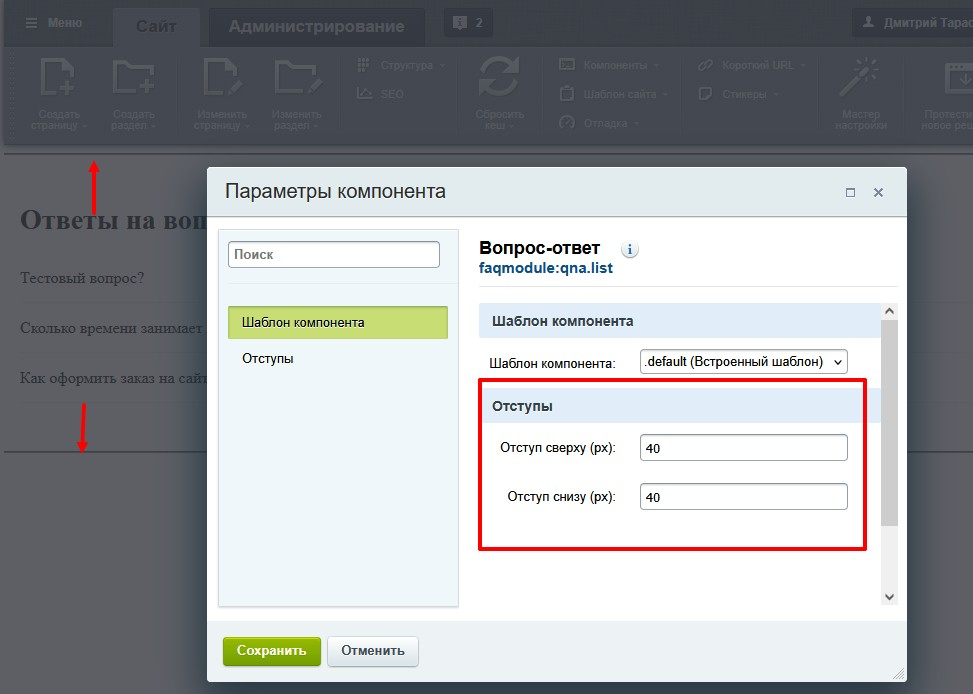
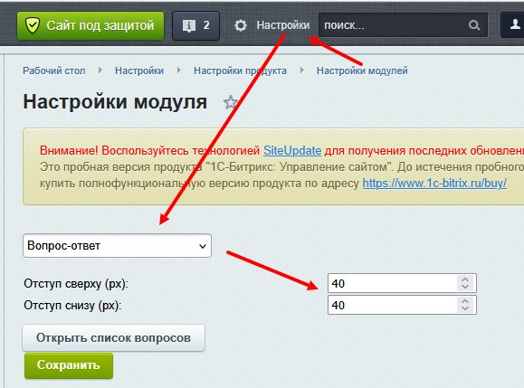
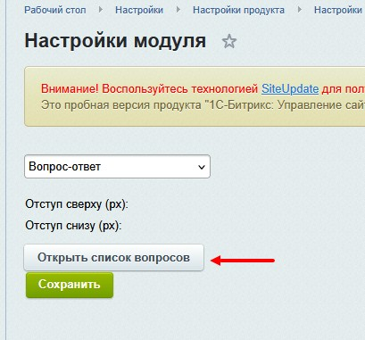
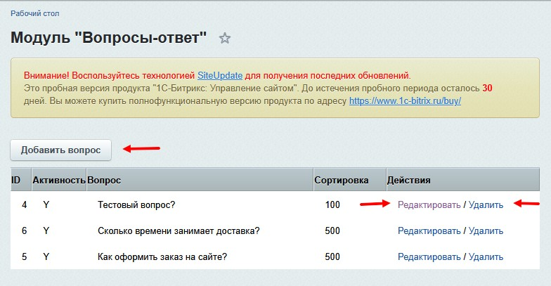

# FAQModule

## Установка
1. Распакуйте `local/` в корень проекта на Битриксе.
2. В админке: Маркетплейс -> Установленные решения -> **Вопрос-ответ (faqmodule.qna)** -> Установить.
3. Настройка модуля: `/bitrix/admin/settings.php?lang=ru&mid=faqmodule.qna`.

## Контент
- Список вопросов: `/bitrix/admin/faqmodule_qna_list.php`.
- Таблица: `b_faqmodule_qna`.

## Вставка на страницу
```php
<?$APPLICATION->IncludeComponent(
	"faqmodule:qna.list", 
	".default", 
	array(
		"PADDING_TOP" => "40", // если отступы не установлены то их значение формируется из настроек модуля /bitrix/admin/settings.php?lang=ru&mid=faqmodule.qna
		"PADDING_BOTTOM" => "40"
	),
	false
);?>
```

## Отступы
Изменить отступы можно в параметрах компонента через фронт сайта  
  
а если отступы не установлены в параметрах компонента, то их значение формируется из настроек модуля `/bitrix/admin/settings.php?lang=ru&mid=faqmodule.qna`  
  

## Добавление/редактирование/удаление вопросов
Открыть **Список вопросов** можно через настройку модуля `/bitrix/admin/settings.php?lang=ru&mid=faqmodule.qna` по кнопке  
  
или через урл `/bitrix/admin/faqmodule_qna_list.php`.  

**Добавить/Редактировать/Удалить** вопрос и ответ можно через соответствующие ссылки  
  

## Демо
Проверить работу модуля можно на сайте  
http://vossar8q.beget.tech/